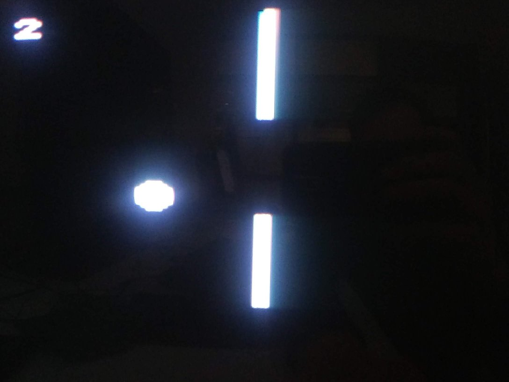

# Some Arduino Games

Here are some simple video games that have been written for the Arduino-tvout platform. Just few resistors make a n Arduino a primitive video game console. The parts cost less than 6 euros when ordered from China. The game uses the [TVout library](https://github.com/Avamander/arduino-tvout) to produce a black-and-white composite video signal and sound. Therefore, the game can be connected to the most common televisions (with a yellow RCA plug for video input).

Below is a list of currently implemented video games.

| Game | Name | Description |
| ---- | ---- | ----------- |
|  | ti-ti | A video game in which you control Ti-ti bear, who tries to catch falling ribbons from the sky. The game speeds up the further you play, so be careful. With music! |
|  | scorched earth | An 8-bit two-player version of the classic Scorched Earth DOS game. Destructible terrain, gauges, and many other cool features. |
|  | snake | The good old Snake game, although the snake doesn't get very long before a bug cuts it in half (please consider making a pull request to straghten the snake out) |
|  | breakout | Breakout clone. This one was written by AI (ChatGPT4), but I had to iron out some issues. Perfectly playable.|
|  | flappy | Not a Flappy bird, but a flappy ball.|

## Hardware

You will need an Arduino board with an ATmega328P microcontroller, e.g., an Arduino Uno or Nano. Additionally, you'll need:

* 3x 470 ohm resistors
* 1x 1 kilohm resistor
* 2x male RCA connectors with screw or pressure terminals
* 1x potentiometer (adjustable resistor) AND/OR
* 3x push buttons
* some lengths of wire
* USB cable or other way of programming and powering the board

### Cost estimate

(prices for ordering from eBay in 2016 or so)

| Item | Price | Notes |
| ---- | ----- | ----- |
| Arduino /w 328p | 2.17 € | Mini-USB Nano V3.0 ATmega328P Arduino board |
| Potentiometer | 0.23 € | 10 pcs. in a batch |
| Resistors (470, 1k) | 0.04 € | 300 pcs. in a batch |
| 2x RCA connectors | 0.20 € | 10 pcs. in a batch |
| Wires | 0.24 € | 40 pcs. in a batch |
| **Total** | **2.87 €** | |

### Circuit

[Schematic](images/schematic.png)

[Connections](images/connections.jpg)

The connection instructions and schematic do not include the paddle controller or audio output. Consult the textual instructions below.

In summary:
* Composite video RCA connector to three wires:
  * Shield to GND
  * Inner two wires: 1k ohm - PIN_D9 and 470 ohm - PIN_D7
* Audio (mono) RCA connector to two wires:
  * Shield to GND
  * Inner 470 ohm - PIN_D11
* For the optional paddle controller / potentiometer connect three wires:
  * 5V
  * 470 ohm - PIN_A2
  * GND
